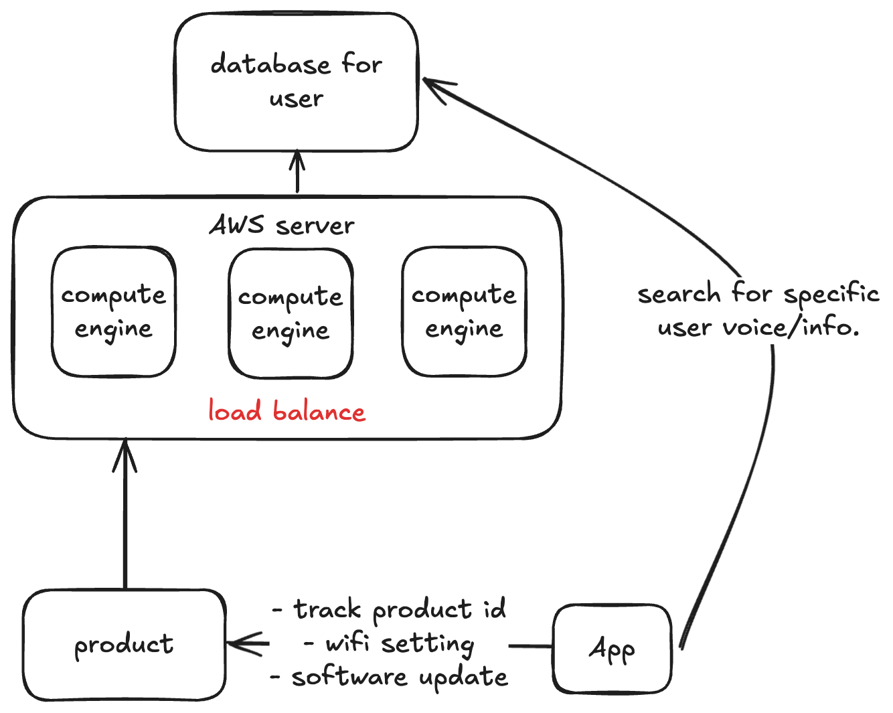
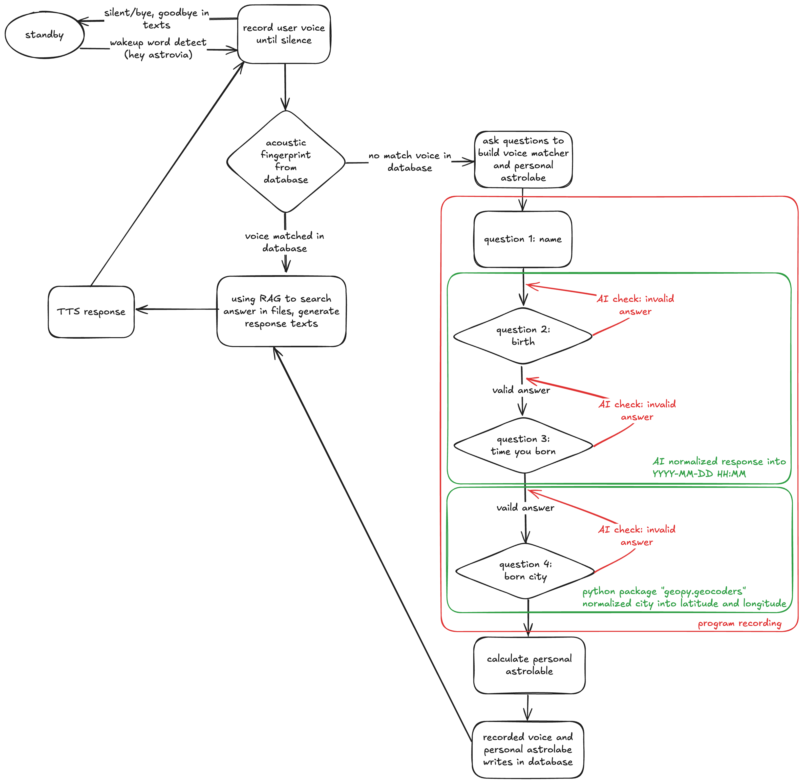

# AI Astrologer Bot

[繁體中文](README_TW.md) | English

This project is under development. Unauthorized use or distribution is prohibited.

## Project Introduction

This project is designed as an AI astrology terminal product. The system includes functions such as wake word detection, speaker verification, astrology, and user natal chart calculation. The codebase is divided into server-side and client-side; here, only the standalone version is demonstrated.

The project has been tested on `macOS 15.6.1` with `Python 3.13.3`.

## Product Architecture



## Project Structure

```
.
├── astrolabe.py                      # Calculate user natal charts
├── check.py                          # Validate user responses
├── files                             # Directory for reference files
│   └── 518091629-鲁道夫-占星全书.pdf   # Astrology book
├── hey_astrovia.onnx                 # Wake word model trained with OpenWakeWord
├── hey_astrovia.tflite               # Wake word model trained with OpenWakeWord
├── main.py                           # Main program
├── pretrained_models                 # Speaker recognition models
│   ├── skip..
├── profiles                          # Directory for user data
│   ├── justin.txt                    # User information and natal chart
│   └── justin.wav                    # User voice sample for speaker verification
├── rag.py                            # Retrieval-Augmented Generation
├── requirements.txt         
└── voice_matcher.py                  # Speaker verification
```

## Dependencies

* Wake word: [openWakeWord](https://github.com/dscripka/openWakeWord)
* STT: Python `faster-whisper`
* TTS: [coqui TTS](https://github.com/coqui-ai/TTS), with the [alltalk tts](https://github.com/erew123/alltalk_tts) framework
* RAG: [bge-m3](https://huggingface.co/BAAI/bge-m3)
* LLM: [gemma3:12b](https://ollama.com/library/gemma3:12b)
* Speaker verification: [spkrec-ecapa-voxceleb](https://huggingface.co/speechbrain/spkrec-ecapa-voxceleb)

## Workflow


